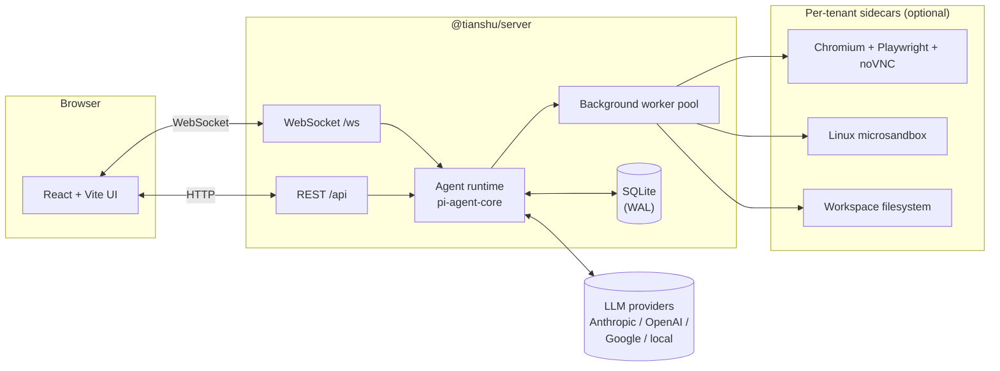

<div align="center">

# 天枢 · Tianshu

**An open AI agent platform with a sidecar browser. Built in public.**

[](https://github.com/tianshu-ai/tianshu/actions/workflows/ci.yml)
[](./LICENSE)
[](https://nodejs.org)
[](./CONTRIBUTING.md)

⭐ *Tianshu (天枢) — the brightest star of the Big Dipper, the celestial pivot.*

[中文](./README.zh-CN.md) · [What it will be](#what-it-will-be) · [Why](#why) · [Quick start](#quick-start) · [Roadmap](#roadmap) · [Build log](#build-log) · [Contributing](./CONTRIBUTING.md)

</div>

---

## 🚧 Status: Day 0

This repository was created on **2026-06-03** and we're shipping it before
it's ready on purpose. The plan is to grow it in public — every meaningful
change will go out as a [DEV_LOG](./docs/DEV_LOG.md) entry, and follow-up
videos / threads on the channels listed below.

If you starred this on day 0, thank you. Come back in a week and there
should be something to actually run.

## What it will be

Tianshu is a self-hostable, multi-tenant **AI agent platform** built on
[`@mariozechner/pi-agent-core`](https://www.npmjs.com/package/@mariozechner/pi-agent-core).
The opinionated parts:

- 🌐 **A real Chromium sidecar per tenant** — Playwright + noVNC. The
  agent navigates, clicks, types; you watch it live in a side panel.
- 📦 **A real Linux sandbox per tenant** — every `exec` runs isolated.
  Crash it, fork-bomb it, fill the disk — your host is fine.
- 📁 **A real workspace filesystem per tenant** — the agent reads and
  writes files; you preview them in the UI; they persist across sessions.
- 🤖 **Background workers, not "tools"** — dispatch parallel agents onto
  a Kanban board, watch elapsed time per task, intervene when one stalls.
- 🏢 **Multi-tenancy from row 1** — every record carries `tenantId`.
  Sidecars, workspaces, and worker pools are tenant-isolated.

A previous closed-source iteration of this idea has been running in the
maintainer's day-to-day setup for months. This repo is the from-scratch,
open-source rebuild.

## Why

> "What if the agent could actually do the work — in a real browser, in a
> real shell, on real files — and you could watch it?"

Most "AI chat" platforms are wrappers around a chat completions endpoint.
Tianshu starts from the other end: the agent runtime is real software,
the sidecar is a real browser, the sandbox is a real container. The chat
UI is the surface, not the product.

For the long version of the motivation, see the launch post:

- 📝 dev.to — *Three things AI agents keep getting wrong (and why I'm
  rebuilding the platform from scratch)*
  → <https://dev.to/tianshu_ai/three-things-ai-agents-keep-getting-wrong-and-why-im-rebuilding-the-platform-from-scratch-42p6>
- 🎥 YouTube — *Building an AI agent platform in public — starting from
  three pains I want to fix* → <https://youtu.be/Xw7c3JrlUVo>

## Quick start

> ⚠️ Day 0 — you get a health endpoint and a hello-world UI. The fun
> stuff (agent runtime, browser sidecar, task board) lands as PRs over
> the coming weeks.

```bash
git clone https://github.com/tianshu-ai/tianshu.git
cd tianshu

cp .env.example .env

npm install
npm run dev
```

This starts:

- **Server** at <http://localhost:3110> (Express + WebSocket, hot reload)
- **Web** at <http://localhost:5183> (Vite dev server, HMR)

The web app proxies `/api` and `/ws` to the server. Visit
<http://localhost:5183> and you should see green health JSON.

> Note: defaults are `3110 / 5183` (and not the more common `3100 / 5173`)
> so this repo can run alongside its closed-source predecessor on the
> same dev machine. Override via `PORT=` / vite config if you'd rather
> use the legacy ports.

### Useful commands

```bash
# build everything (type-check + bundle)
npm run build

# tests
npm test

# server only
npm run dev   -w packages/server
npm run build -w packages/server

# web only
npm run dev   -w packages/web
npm run build -w packages/web
```

## Architecture (target)



```text
tianshu/
├── packages/
│   ├── server/   # Express + WS backend, agent runtime
│   └── web/      # React + Tailwind + Vite frontend
└── docs/         # DEV_LOG, architecture notes, RFCs
```

The agent runtime is built on
[`@mariozechner/pi-agent-core`](https://www.npmjs.com/package/@mariozechner/pi-agent-core)
by [@badlogic](https://github.com/badlogic). Standing on the shoulders of
giants.

## Roadmap

The five things most likely to land first:

- [ ] **Tenant model** — `tenantId` everywhere, dev-mode JWT
- [ ] **Agent runtime wired up** — `pi-agent-core` streaming over WS
- [ ] **Browser sidecar** — Playwright + noVNC inside Docker
- [ ] **Microsandbox** — per-tenant Linux box for `exec` / file I/O
- [ ] **Task board** — background workers as Kanban cards

Tracked in [GitHub Issues](https://github.com/tianshu-ai/tianshu/issues).

## What it's not

- ❌ A drop-in ChatGPT clone — go look at LibreChat or Open WebUI.
- ❌ A no-code workflow builder — Dify is the right shape for that.
- ❌ A hosted SaaS — no billing, no SSO, no SLA. Run it for your team.
- ❌ An LLM dev framework — it's an *application*; the runtime is
  pi-agent-core underneath.

## Build log

We post a development log every week. Pick the channel that fits you:

| Where | Language | Format |
| --- | --- | --- |
| [dev.to/tianshu_ai](https://dev.to/tianshu_ai) | English | Long-form articles |
| [YouTube @Tianshu-AI](https://www.youtube.com/@Tianshu-AI) | English | Long-form videos |
| Bilibili 天枢AI *(launching)* | 中文 | Long-form videos |
| X / Twitter *(launching)* | English | Build-in-public threads |
| 小红书 / 抖音 *(launching)* | 中文 | Short-form clips |

## Contributing

PRs, issues, and discussions are all welcome — even on day 0. See
[CONTRIBUTING.md](./CONTRIBUTING.md) for setup and code style.

For security issues please follow [SECURITY.md](./SECURITY.md). Do not
file vulnerabilities in public issues.

## License

[Apache License 2.0](./LICENSE) © 2026 Yu Yu and Tianshu contributors.

Built on [pi-agent-core](https://github.com/badlogic/pi-mono) (MIT) by
[@badlogic](https://github.com/badlogic).
