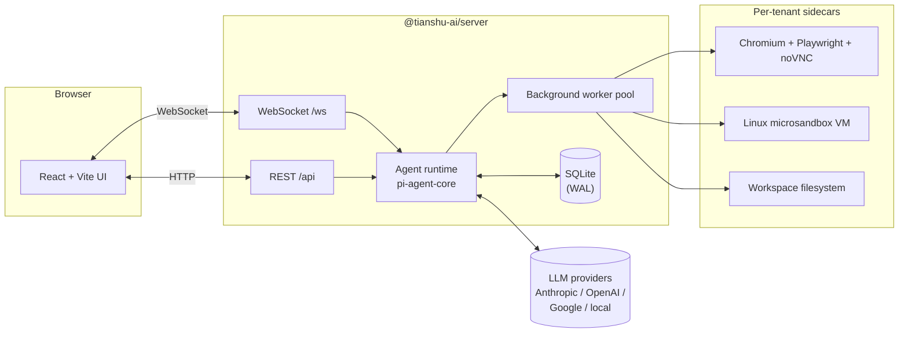

<h1 align="center">Tianshu · 天枢</h1>

<p align="center">
  <strong>The self-hosted AI agent platform — with a real browser, a real sandbox.</strong>
</p>

<p align="center">
  <a href="https://github.com/tianshu-ai/tianshu/actions/workflows/ci.yml"></a>
  <a href="https://www.npmjs.com/package/@tianshu-ai/tianshu"></a>
  <a href="https://github.com/tianshu-ai/tianshu/releases"></a>
  <a href="./LICENSE"></a>
  <a href="https://github.com/tianshu-ai/tianshu/stargazers"></a>
  <a href="https://www.typescriptlang.org/"></a>
  <a href="https://nodejs.org"></a>
</p>

<p align="center">
  <a href="./README.md">English</a> ·
  <a href="./README.zh-CN.md">简体中文</a> ·
  <a href="#-install">🚀 Install</a> ·
  <a href="#-what-you-get">✨ What you get</a> ·
  <a href="#-first-run--5-minutes-start-to-finish">👋 First run</a> ·
  <a href="#️-day-2-control">🎛️ Day-2 control</a> ·
  <a href="#️-architecture">🏗️ Architecture</a> ·
  <a href="#️-roadmap">🗺️ Roadmap</a>
</p>

<p align="center">
  <em>⭐ Tianshu (天枢) — the brightest star of the Big Dipper, the celestial pivot.</em>
</p>

<!--
  TODO: drop a 1600×900+ PNG/GIF at docs/assets/hero.png
  showing the chat UI with the sandbox exec output AND the
  browser sidecar in one frame. Recommend either:
    (a) agent live-editing a file with the file tree visible,
    (b) agent driving a real Chromium tab on the right while
        typing on the left.
  When the file exists, the markdown below renders the image;
  until then GitHub shows a broken-image placeholder that
  links to the README's anchor.
-->
<!--  -->

---

## 🚀 Install

### Prerequisites

| What           | Why                                                |
|----------------|----------------------------------------------------|
| **Node 22+**   | Runtime. Use a Node manager (`nvm` / `volta` / `asdf`); avoid system Node with `sudo`. |
| **macOS Apple Silicon** *or* **Linux + KVM** | Sandbox layer ([microsandbox](https://github.com/microsandbox/microsandbox)) needs hardware virt. Chat surface still works elsewhere, but `exec` / browser tools won't. |
| **An LLM API key** | Anthropic, OpenAI, or Google. Or a local model server reachable on the network. |

### One command

```bash
npm install -g @tianshu-ai/tianshu@latest
```

Don't `sudo`. If you hit `EACCES`, switch to a Node manager that
puts the global bin under your user directory — not a system
folder.

### Configure your provider

```bash
tianshu setup
```

A 30-second interactive wizard. It:

1. Asks which provider to use (Anthropic / OpenAI / Google).
2. Reads your API key with a hidden prompt.
3. Writes `~/.tianshu/config.json` (settings) and `~/.tianshu/.env`
   (secret).

Non-interactive flavour for Docker / CI:

```bash
tianshu setup --non-interactive --provider=anthropic --api-key=sk-***
```

### Start the service

```bash
tianshu start
```

On macOS this installs a launchd agent
(`~/Library/LaunchAgents/ai.tianshu.prod.plist`) that auto-starts
at login and auto-restarts on crash. Linux systemd support is on
the roadmap; for now, run `npm run dev` from a checkout.

Open <http://localhost:3110> and start chatting.

### Verify everything

```bash
tianshu doctor
```

Reports across 8 dimensions — runtime / version freshness / config
files / LLM providers / network / sandbox / plugins / tenant DBs.
Read-only. Run it anytime something feels off.

---

## ✨ What you get

Tianshu is **a runtime, not a chatbox.** Three things make it different:

🌐 **A real Chromium sidecar per tenant.** Playwright + noVNC. The agent
navigates, clicks, types — you watch it live in a side panel, take the
mouse back when you want to.

📦 **A real Linux sandbox per tenant.** Every `exec` runs in a
[microsandbox](https://github.com/microsandbox/microsandbox) VM. Crash
it, fork-bomb it, fill the disk — your host is untouched.

📁 **A real per-tenant workspace.** The agent reads and writes files
you can preview in the UI; they persist across sessions. The file
tree is a first-class citizen, not a "tool output."

Plus:

- 🤖 **Background workers, not "tools."** Dispatch parallel agents
  onto a Kanban board; watch elapsed time per task; intervene when
  one stalls.
- 🏢 **Multi-tenant from row 1.** Every record carries `tenantId`.
  Sidecars, workspaces, and worker pools are tenant-isolated.
- 🧠 **A setup assistant that fixes things.** `tianshu setup` runs a
  Claude/Codex-driven wizard with 18 tools: it can read your doctor
  report, enable plugins, write config, build sandboxes, and even
  upgrade itself. See it talk you through it in
  [the launch video](https://youtu.be/Xw7c3JrlUVo).

---

## 👋 First run — 5 minutes start to finish

A narrated walk-through. From zero to "agent driving a real
browser on your screen":

### Step 1 · Install + wizard (~2 min)

```bash
npm install -g @tianshu-ai/tianshu@latest
tianshu setup
```

The wizard picks a provider, reads your key, writes config. If
you skip the LLM step you can edit `~/.tianshu/config.json` by
hand later.

### Step 2 · Start the service (~10 s)

```bash
tianshu start
```

The wizard already verified network / config. `tianshu start`
installs the launchd agent and waits for the server to answer
`/api/health`.

### Step 3 · Open the SPA, ask the setup agent for help

```bash
open http://localhost:3110
```

In the chat, type:

> **You:** Set up sandboxes so I can use the browser tool.

The in-chat setup agent has 18 tools. It will:

1. Run `sandbox_inventory` to see what's already built.
2. If a snapshot is missing, propose `build_sandbox
   (template='task-runner')` and ask you to confirm.
3. After ~10 min (cold) or ~3 min (warm) the snapshot lands; the
   agent publishes it to the `task` role pointer with
   `use_sandbox_build`.
4. Repeat for the browser layer
   (`task-runner-with-browser` on top of the task snapshot).

If the build looks stuck, the agent calls `check_build_progress`
first — it reads the launchd logs, classifies the build state
(`in_progress` / `stalled` / `errored`), and tells you whether
to wait or retry. It will NOT silently retry a 10-minute build
that's still pulling apt packages.

### Step 4 · Try the browser tool

> **You:** Open hacker news and tell me the top story right now.

Watch the side panel: a real Chromium tab navigates. The agent
can click, type, scroll. You can take the mouse back any time.

Done. You've got a working agent.

### What if I don't have an API key?

A hosted demo is on the roadmap at
[demo.tianshu-ai.com](https://demo.tianshu-ai.com) *(coming soon)*
— same image, shared sandbox pool.

### What if something goes wrong?

| Symptom | First step |
|---|---|
| `tianshu doctor` flags a blocker | Read the line; the `detail` field has the fix. |
| Browser tool says "runner not ready" | `sandbox_inventory` in chat; build the missing snapshot. |
| `tianshu start` says "server didn't respond" | `tianshu logs --stream=err -f` for the actual error. |
| Setup wizard wedged | Ctrl-C, re-run `tianshu setup --wizard`. |
| `npm install -g` errors with EACCES | Switch to nvm / volta / asdf. Don't `sudo`. |

More in [Troubleshooting](docs/getting-started.md#troubleshooting).

---

## 🎛️ Day-2 control

Once things are running, these are the commands you'll use daily:

```bash
tianshu status               # plist label, pid, port, /api/health
tianshu logs -f              # tail stdout + stderr
tianshu restart              # bounce the server
tianshu stop                 # bootout the launchd agent
tianshu tenant list          # tenants + users + open-in-browser URLs
tianshu update               # check + install npm latest
tianshu update --check       # only check, exit 0/1/2
```

Behind a Cloudflare tunnel or reverse proxy? Set
`server.publicUrl` in `~/.tianshu/config.json` once — every CLI
command prints that hostname instead of `localhost`.

When something breaks:

```bash
tianshu doctor                       # what's wrong?
tianshu logs -f                      # what's the server saying?
ls ~/Library/LaunchAgents/ai.tianshu*.plist   # is the agent installed?
launchctl list | grep tianshu        # is it loaded? PID? exit code?
```

Deeper guides:
[Getting started](docs/getting-started.md) ·
[Updating](docs/updating.md) ·
[Running as a service](docs/running.md) ·
[Developing from a checkout](docs/developing.md).

---

## 🏗️ Architecture



The agent runtime stands on
[`@earendil-works/pi-agent-core`](https://www.npmjs.com/package/@earendil-works/pi-agent-core)
by [@badlogic](https://github.com/badlogic). The sandbox layer is
[microsandbox](https://github.com/microsandbox/microsandbox).

A 0.x repo, but the core loop — chat, sandbox `exec`, sidecar browser,
multi-tenant filesystem, background workers — works end-to-end today.
See the [Architecture Decision Records](docs/architecture/) for
the full picture.

---

## 🗺️ Roadmap

**Shipped (0.3.x)**

- [x] `npm install -g @tianshu-ai/tianshu` published to npm
- [x] Production single-port server (SPA + API on `:3110`)
- [x] `tianshu doctor` — runtime / config / network / sandbox / plugins
- [x] Setup agent with 18 tools (inventory, build, fix, upgrade)
- [x] Tenant model, plugin registry, sandbox role pointers

**Next (0.4.x)**

- [ ] Docker image with sandbox layer baked in
- [ ] Linux systemd user service (matches macOS launchd UX)
- [ ] Hosted demo at `demo.tianshu-ai.com`
- [ ] Skills marketplace (registry + install command)

Tracked in [GitHub Issues](https://github.com/tianshu-ai/tianshu/issues).

---

## 🚫 What it's not

- ❌ A drop-in ChatGPT clone — see
  [LibreChat](https://github.com/danny-avila/LibreChat),
  [Open WebUI](https://github.com/open-webui/open-webui).
- ❌ A no-code workflow builder — see
  [Dify](https://github.com/langgenius/dify),
  [Flowise](https://github.com/FlowiseAI/Flowise).
- ❌ A hosted SaaS — no billing, no SSO, no SLA. Run it on a box you own.
- ❌ An LLM dev framework — Tianshu is an *application* on top of
  pi-agent-core.

---

## 📺 Build log

A development log goes out roughly every week. Pick the channel that
fits you:

| Channel | Language | Format |
| --- | --- | --- |
| [dev.to/tianshu_ai](https://dev.to/tianshu_ai) | English | Long-form articles |
| [YouTube @Tianshu-AI](https://www.youtube.com/@Tianshu-AI) | English | Long-form video |
| Bilibili 天枢AI *(launching)* | 中文 | Long-form video |
| X / Twitter *(launching)* | English | Build-in-public threads |
| 小红书 / 抖音 *(launching)* | 中文 | Short-form clips |

---

## 🤝 Contributing

PRs, issues, and discussions are welcome — even on day 0. See
[CONTRIBUTING.md](./CONTRIBUTING.md) for setup and code style.

For security issues please follow [SECURITY.md](./SECURITY.md). **Do
not** file vulnerabilities in public issues.

---

## 📜 License

[Apache License 2.0](./LICENSE) © 2026 Yu Yu and Tianshu contributors.

Built on [pi-agent-core](https://github.com/badlogic/pi-mono) (MIT) by
[@badlogic](https://github.com/badlogic), and
[microsandbox](https://github.com/microsandbox/microsandbox) (Apache-2.0)
by [@nyxxxie](https://github.com/nyxxxie) and contributors.
