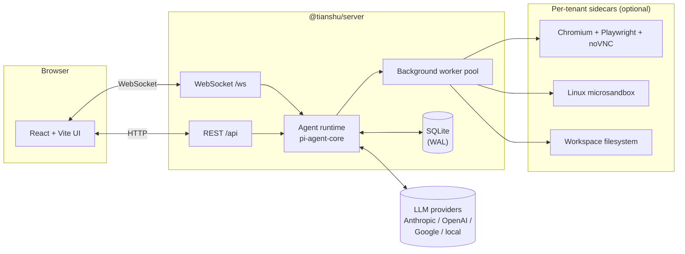

<div align="center">

# 天枢 · Tianshu

**An open AI agent platform with a sidecar browser. Built in public.**

[](https://github.com/tianshu-ai/tianshu/actions/workflows/ci.yml)
[](./LICENSE)
[](https://nodejs.org)
[](./CONTRIBUTING.md)

⭐ *Tianshu (天枢) — the brightest star of the Big Dipper, the celestial pivot.*

[中文](./README.zh-CN.md) · [What it will be](#what-it-will-be) · [Why](#why) · [Quick start](#quick-start) · [Roadmap](#roadmap) · [Build log](#build-log) · [Contributing](./CONTRIBUTING.md)

</div>

---

## Status: 0.x preview

The core loop — chat, sandbox `exec`, sidecar browser, multi-tenant
filesystem, background workers — all works end-to-end. Build-in-public
stays the same: every meaningful change ships as a [DEV_LOG](./docs/DEV_LOG.md)
entry plus follow-up content on the channels below.

**Hardware needed**: macOS Apple Silicon, or Linux + KVM. The sandbox
layer (microsandbox) won't boot anywhere else; the chat surface still
works but `exec` / browser tools will be unavailable.

## What it will be

Tianshu is a self-hostable, multi-tenant **AI agent platform** built on
[`@mariozechner/pi-agent-core`](https://www.npmjs.com/package/@mariozechner/pi-agent-core).
The opinionated parts:

- 🌐 **A real Chromium sidecar per tenant** — Playwright + noVNC. The
  agent navigates, clicks, types; you watch it live in a side panel.
- 📦 **A real Linux sandbox per tenant** — every `exec` runs isolated.
  Crash it, fork-bomb it, fill the disk — your host is fine.
- 📁 **A real workspace filesystem per tenant** — the agent reads and
  writes files; you preview them in the UI; they persist across sessions.
- 🤖 **Background workers, not "tools"** — dispatch parallel agents onto
  a Kanban board, watch elapsed time per task, intervene when one stalls.
- 🏢 **Multi-tenancy from row 1** — every record carries `tenantId`.
  Sidecars, workspaces, and worker pools are tenant-isolated.

A previous closed-source iteration of this idea has been running in the
maintainer's day-to-day setup for months. This repo is the from-scratch,
open-source rebuild.

## Why

> "What if the agent could actually do the work — in a real browser, in a
> real shell, on real files — and you could watch it?"

Most "AI chat" platforms are wrappers around a chat completions endpoint.
Tianshu starts from the other end: the agent runtime is real software,
the sidecar is a real browser, the sandbox is a real container. The chat
UI is the surface, not the product.

For the long version of the motivation, see the launch post:

- 📝 dev.to — *Three things AI agents keep getting wrong (and why I'm
  rebuilding the platform from scratch)*
  → <https://dev.to/tianshu_ai/three-things-ai-agents-keep-getting-wrong-and-why-im-rebuilding-the-platform-from-scratch-42p6>
- 🎥 YouTube — *Building an AI agent platform in public — starting from
  three pains I want to fix* → <https://youtu.be/Xw7c3JrlUVo>

## Quick start

```bash
git clone https://github.com/tianshu-ai/tianshu.git
cd tianshu

npm install
npm run setup        # interactive: pick provider, paste key, write config
npm run doctor       # verify everything is wired up
npm run dev          # starts server (3110) + web (5183) + plugins
```

Open <http://localhost:5183> and start chatting.

### What `npm run setup` does

It's an interactive wizard (built on `@clack/prompts`, same family as
[OpenClaw](https://docs.openclaw.ai)) that:

- Asks which LLM provider to use (Anthropic / OpenAI / Google).
- Reads your API key with a hidden input.
- Writes `~/.tianshu/config.json` (provider settings, models, default).
- Writes `<repo>/.env` (your key, references via `${VAR}` from the config).

Non-interactive mode is supported for Docker / CI:

```bash
npx tianshu setup --non-interactive \
  --provider=anthropic --api-key=sk-***
```

### What `npm run doctor` checks

```
┌  Tianshu doctor
│
◇  Runtime         → Node ≥ 22, OS supported
◇  Config files    → ~/.tianshu/config.json + .env present + parseable
◇  LLM providers   → at least one provider has a non-empty API key,
│                    defaultModel resolves
◇  Network         → ports 3110 / 5183 free
◇  Sandbox         → microsandbox binary present (--probe-sandbox
│                    boots an alpine VM as a smoke test)
◇  Builtin plugins → manifests parse, ids unique
◇  Tenant DBs      → each tenant's sqlite opens cleanly
└  Setup looks healthy
```

Use it whenever something doesn't feel right — it's read-only.

### Installing globally

When 0.x stabilises this will be on npm:

```bash
npm install -g @tianshu-ai/tianshu
tianshu setup --wizard
tianshu doctor
tianshu start
```

For now, run from a checkout. Commands are the same, you just invoke
them via `npm run` or `node bin/tianshu.mjs`.

### Useful flags

```bash
# Skip the readiness check on startup (useful for empty-shell deploys)
TIANSHU_IGNORE_SETUP=1 npm run dev

# Probe each provider's /v1/models endpoint to test reachability
npm run doctor -- --probe-providers

# Boot a real microsandbox VM as a smoke test (~30s, pulls image)
npm run doctor -- --probe-sandbox
```

> Default ports are `3110 / 5183` (not the more common `3100 / 5173`)
> so this repo can run alongside its closed-source predecessor on the
> same dev machine. Override via `PORT=` / vite config if you want.

### Running as a background service

`npm run dev` is foreground — Ctrl-C kills it and it doesn't survive
reboots. For a permanent dev box use the platform's native service
manager:

- **macOS**: drop a [`launchd` plist](./docs/running.md#macos--launchd-recommended-for-a-permanent-dev-box) under `~/Library/LaunchAgents/` (template + commands in [docs/running.md](./docs/running.md)).
- **Linux**: TODO; same shape as launchd via systemd user service.
- **Docker**: TODO; lands when `tianshu start` (single-port production server) does.

**Don't** use `nohup`, `&`, or `screen` — they don't survive logout
and don't auto-restart on crash.

### Useful commands

```bash
# build everything (type-check + bundle)
npm run build

# tests
npm test

# server only
npm run dev   -w packages/server
npm run build -w packages/server

# web only
npm run dev   -w packages/web
npm run build -w packages/web
```

## Architecture (target)



```text
tianshu/
├── packages/
│   ├── server/   # Express + WS backend, agent runtime
│   └── web/      # React + Tailwind + Vite frontend
└── docs/         # DEV_LOG, architecture notes, RFCs
```

The agent runtime is built on
[`@mariozechner/pi-agent-core`](https://www.npmjs.com/package/@mariozechner/pi-agent-core)
by [@badlogic](https://github.com/badlogic). Standing on the shoulders of
giants.

## Roadmap

### Done (0.2.x)

- [x] **Tenant model** — `tenantId` everywhere, dev-mode JWT
- [x] **Agent runtime wired up** — `pi-agent-core` streaming over WS
- [x] **Browser sidecar** — Playwright + noVNC via microsandbox
- [x] **Microsandbox** — per-tenant + per-task Linux VMs for `exec` / file I/O
- [x] **Task board** — background workers as Kanban cards
- [x] **Doctor + setup wizard** — `tianshu doctor` / `tianshu setup --wizard`

### Next (0.3.x)

- [ ] `npm install -g @tianshu-ai/tianshu` published to npm
- [ ] `tianshu start` single-port server (web + API together for prod)
- [ ] Docker image with sandbox layer baked in
- [ ] Hosted demo at `demo.tianshu-ai.com`

Tracked in [GitHub Issues](https://github.com/tianshu-ai/tianshu/issues).

## What it's not

- ❌ A drop-in ChatGPT clone — go look at LibreChat or Open WebUI.
- ❌ A no-code workflow builder — Dify is the right shape for that.
- ❌ A hosted SaaS — no billing, no SSO, no SLA. Run it for your team.
- ❌ An LLM dev framework — it's an *application*; the runtime is
  pi-agent-core underneath.

## Build log

We post a development log every week. Pick the channel that fits you:

| Where | Language | Format |
| --- | --- | --- |
| [dev.to/tianshu_ai](https://dev.to/tianshu_ai) | English | Long-form articles |
| [YouTube @Tianshu-AI](https://www.youtube.com/@Tianshu-AI) | English | Long-form videos |
| Bilibili 天枢AI *(launching)* | 中文 | Long-form videos |
| X / Twitter *(launching)* | English | Build-in-public threads |
| 小红书 / 抖音 *(launching)* | 中文 | Short-form clips |

## Contributing

PRs, issues, and discussions are all welcome — even on day 0. See
[CONTRIBUTING.md](./CONTRIBUTING.md) for setup and code style.

For security issues please follow [SECURITY.md](./SECURITY.md). Do not
file vulnerabilities in public issues.

## License

[Apache License 2.0](./LICENSE) © 2026 Yu Yu and Tianshu contributors.

Built on [pi-agent-core](https://github.com/badlogic/pi-mono) (MIT) by
[@badlogic](https://github.com/badlogic).
