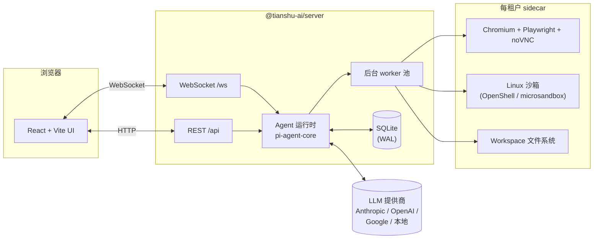

<h1 align="center">Tianshu · 天枢</h1>

<p align="center">
  <strong>自托管 AI Agent 平台 —— 带一个真浏览器，带一个真沙箱。</strong>
</p>

<p align="center">
  <a href="https://github.com/tianshu-ai/tianshu/actions/workflows/ci.yml"></a>
  <a href="https://www.npmjs.com/package/@tianshu-ai/tianshu"></a>
  <a href="https://github.com/tianshu-ai/tianshu/releases"></a>
  <a href="./LICENSE"></a>
  <a href="https://github.com/tianshu-ai/tianshu/stargazers"></a>
  <a href="https://www.typescriptlang.org/"></a>
  <a href="https://nodejs.org"></a>
</p>

<p align="center">
  <a href="./README.md">English</a> ·
  <a href="./README.zh-CN.md">简体中文</a> ·
  <a href="#-安装">🚀 安装</a> ·
  <a href="#-你能拿到什么">✨ 你能拿到什么</a> ·
  <a href="#-首次跑--从零到5分钟">👋 首次跑</a> ·
  <a href="#️-日常控制">🎛️ 日常控制</a> ·
  <a href="#️-架构">🏗️ 架构</a> ·
  <a href="#️-路线图">🗺️ 路线图</a>
</p>

<p align="center">
  <em>⭐ 天枢 —— 北斗第一星，主导方向。</em>
</p>

<!-- TODO: hero 截图 / GIF。一旦 docs/assets/hero.png 存在就取消下面这行注释。 -->
<!--  -->

---

## 🚀 安装

### 前置条件

| 项  | 为什么                                            |
|----|------------------------------------------------|
| **Node 22+** | 运行时。用 Node 管理器（`nvm` / `volta` / `asdf`），别 `sudo` 装系统 Node。 |
| **Docker**（推荐）或 **macOS Apple Silicon / Linux + KVM** | 沙箱层。默认的 **OpenShell** 后端需要跑着的 Docker（Docker Desktop / Colima / OrbStack …）；备选的 **microsandbox** 后端不需 Docker、但要硬件虚拟化。二选一 — 两者互斥。两个都没时聊天仍可用，但 `exec` / 浏览器工具不可用。 |
| **一个 LLM API key** | Anthropic / OpenAI / Google，或一个网络可达的本地模型服务。 |

### 一行安装

```bash
npm install -g @tianshu-ai/tianshu@latest
```

别 `sudo`。遇到 `EACCES` 就换个 Node 管理器（nvm / volta /
asdf），让全局装路径落在你的用户目录下。

### 配置 LLM provider

```bash
tianshu setup
```

交互式向导：

1. 问你用哪个 provider（Anthropic / OpenAI / Google）。
2. 隐藏输入读你的 API key。
3. 写 `~/.tianshu/config.json`（配置）和 `~/.tianshu/.env`（秘钥）。

模型配置好后，向导会把你交给 **setup agent** —— 一个跑在同
一个终端里、能帮你把后续配置走完的 LLM 驱动助手。它有 18 个
工具（`run_doctor`、`sandbox_inventory`、`config_write`、
`plugin_enable`、`build_sandbox`、`use_sandbox_build`、
`secret_write`、`apply_update` …），每个会改状态的调用都会先让
你确认。现在能让它帮你做的事：

- *“帮我配一个 web-search 插件的 API key。”* —— 它会问你用哪家
  （Tavily / Brave / SerpAPI / …）、读你的 key、用
  `secret_write` 写到对应租户的插件配置里。不用手改 JSON。
- *“帮我 build 沙箱，我要用浏览器。”* —— 它先调 `sandbox_inventory`
  看看磁盘上已经有什么，再调 `build_sandbox` 和
  `use_sandbox_build` 填上缺的。分层 `task-runner-with-browser`
  snapshot 发布的那一刻起，浏览器工具就能用。
- *“doctor 报 provider 有问题 —— 帮我修。”* —— 它读
  `run_doctor`，找到警告的那行，提议具体该调哪个
  `config_write` / `secret_write` 去修，然后才执行。
- *“我是最新版本么？”* —— 它跑 `check_for_update`，你同意了
  再跑 `apply_update`。

随时能退出（输 *done* / Ctrl-C）再来 —— agent 每次启动从磁盘
重读状态。

Docker / CI 场景（跳过交互式 agent，只写 provider 配置）：

```bash
tianshu setup --non-interactive --provider=anthropic --api-key=sk-***
```

### 启动服务

```bash
tianshu start
```

macOS 上这步装 launchd agent（`~/Library/LaunchAgents/ai.tianshu.prod.plist`），
登录自动启动、崩溃自动重启。Linux systemd 在 roadmap 上，现在先
从 checkout 跑 `npm run dev`。

浏览器打开 <http://localhost:3110> 开始对话。

### 验证一下

```bash
tianshu doctor
```

从 8 个维度体检 —— runtime / 版本新鲜度 / 配置文件 / LLM provider /
网络 / 沙箱 / 插件 / 租户 DB。只读。什么不对劲随时跑。

---

## ✨ 你能拿到什么

Tianshu 是**一个 agent 运行时，不是一个聊天框**。三件事跟同类不一样：

🌐 **每个租户一个真 Chromium sidecar**。Playwright + noVNC。Agent
在里面导航、点击、输入 —— 你在侧边面板里实时看着，想接手鼠标随时
接。

📦 **每个租户一个真 Linux 沙箱**。每次 `exec` 跑在隔离沙箱里 ——
把它搞崩、fork bomb、写满磁盘，宿主机都不受影响。两个可互换的
后端以插件形式提供（**二选一**，互斥）：**OpenShell**（Docker
容器，推荐默认 — Apple Silicon 上几乎零空转 CPU、自带逐 host 的
网络 egress 策略），或
[microsandbox](https://github.com/microsandbox/microsandbox)（
 Hypervisor.framework / KVM 微型 VM，不想装 Docker 时选它）。

📁 **每个租户一个真 workspace**。Agent 读写的文件你在 UI 里能预览、
能持久化。文件树是一等公民，不是某个工具的"输出"。

此外：

- 🎛️ **Workforce Studio — 把 agent 配置变成可版本化的 Solution**。
  不用再手改散在各处的 `agent.json` / `SOUL.md`。Studio 把你
  正在跑的配置（主 agent + 每个 worker + 插件启用集 + prompt
  块）抽成一个 **Solution**，在三栏 IDE 里编辑、与现状 diff、
  导出/导入为文件、并一键**激活**。可单独覆盖某个 worker 的
  模型或执行偏向、包含/排除插件、调 prompt 片段 — 然后原子
  式应用整套。见
  [docs/architecture/solutions.md](docs/architecture/solutions.md)。
- 💻 **OpenCode worker**。除了内置 worker，还可以把
  [opencode](https://github.com/sst/opencode) + oh-my-openagent 跑
  在预建沙箱镜像里作为一类 worker — 近实时 transcript 和已解
  析的工具 chips 回流到看板。
- 🤖 **后台 worker，不是 "tool"**。多个 agent 并行调度到 Kanban
  看板上，每个任务的耗时实时可见，卡住能介入。可在一次 batch
  里定义任务依赖图。
- 🔍 **主 agent 是个 supervisor**。主 agent（天枢，“中枢”之意）
  不只是调度——它跨任务读看板上的所有 worker 表现（耗时、干
  预率、失败原因聚类、token 成本），主动向你提调优建议：
  *“你的 web-research worker 每 5 次跑有 1 次撞 10 分钟 watchdog
  —— 要不要把 `timeoutMs` 改成 15 分钟？”* 分析是推荐面，不是
  自动调优控制环 —— 每个改动都要你确认。详见
  [ADR-0002 §12](docs/architecture/workers.md#12-orchestrator-side-analytics--continuous-improvement)。
- 🏢 **多租户从第一行 schema 起**。每条记录都带 `tenantId`，
  sidecar、workspace、worker pool 全部按租户隔离。
- 🧠 **能修问题的 setup agent**。`tianshu setup` 是个由 Claude/Codex
  驱动的向导，带 18 个工具：能读 doctor 报告、启用插件、写配置、
  build 沙箱、甚至自己升级自己。在
  [启动视频](https://youtu.be/Xw7c3JrlUVo) 里能看到它。
- 🎚️ **图形化的 day-2 控制**。以前手改的东西现在有 Settings 页：
  **Models** 页维护 provider 目录（增删改 provider + 模型、选默认
  模型，key 留在服务端）、**Network Policy** 页看沙箱 egress 拦截并
  一键放行 host、还有 MCP server 和各插件配置页。配置文件仍是真
  相来源 — 两边改都行，自动同步。
- 🔌 **韧性的模型调用**。限流感知的重试（遵守 `Retry-After`），
  客户端断线时指数退避重连并恢复被中断的 turn — 不重复消息、
  不丢 prompt。
- 🔎 **内置免 key 网页搜索**。Exa/Parallel 支撑的 `web_search` +
  `web_fetch` 工具，无需额外 API key。

> ⚠️ **安全提示（0.5.0）**：admin/Settings 页（Models、MCP
> server、Network Policy、插件配置）**目前还没有鉴权门** — 任何
> 已登录用户都能改全局配置。现阶段请以**单个可信运维者**身份
> 跑 Tianshu，不要在多租户机器上把 admin 面暴露给不可信用户。正
> 式鉴权/角色网关会随路线图上的登录功能一起上。

---

## 🧩 插件

上面几乎每一项能力都是一个**插件** — 官方加载、按租户启用，
并以工具 / 管理页 / 渠道的形式暴露给 agent。Tianshu 内置这些：

| 插件 | 功能 |
|---|---|
| **Workspace Files** | 浏览、读取、预览、上传每租户 workspace 里的文件。文件树是 UI 里的一级面板，文件跨 session 持久。 |
| **OpenShell**（推荐沙箱） | 把 agent 的 shell（`exec`）跑在 [NVIDIA OpenShell](https://github.com/NVIDIA/OpenShell) 管理的 Docker 沙箱里。Apple Silicon 上几乎零空转 CPU，自带逐 host 的**网络 egress 策略**（allow-list + 实时拦截日志）。需要 Docker。 |
| **MicroSandbox**（备选沙箱） | 把 `exec` 跑在 [microsandbox](https://github.com/microsandbox/microsandbox) 微型 VM（Apple Virtualization.framework / KVM）— 不需 Docker，但要硬件虚拟化。**与 OpenShell 互斥**，二选一。 |
| **Workboard** | Kanban 任务看板 + worker 池。主 agent 把任务放到 Ready，worker 接走执行（带实时 transcript）并回报，Ready → In-progress → Done。支持任务依赖图和 per-worker 配置。 |
| **Workforce Studio** | 在三栏 IDE 里抽取/编辑/diff/导出导入/**激活**整套 agent 配置（主 agent + 每个 worker + 启用的插件集 + prompt 块），当作可版本化的 **Solution**。 |
| **Web Search** | 免 key 的 `web_search`（托管 Exa / Parallel 端点，无需 API key）+ 把任意页面读成 markdown 的 `web_fetch`。 |
| **WeChat（微信）** | 基于腾讯 iLink bot API 的聊天渠道 — 扫码授权后，授权用户的私信通过渠道系统路由给 agent。 |

在 **Settings → Plugins** 里管理（启用/禁用 + 逐插件配置）。第三
方插件同样方式安装，见
[docs/architecture/plugins.md](docs/architecture/plugins.md)。

---

## 👋 首次跑 —— 从零到5分钟

一个带叙述的走马观花。从零到 "看到 agent 在实际驱动浏览器"：

### 第 1 步 · 安装 + 向导（~2 分钟）

```bash
npm install -g @tianshu-ai/tianshu@latest
tianshu setup
```

向导选个 provider、读你的 key、写配置。LLM 配置可以跳过后手
改 `~/.tianshu/config.json`。

### 第 2 步 · 启动服务（~10 秒）

```bash
tianshu start
```

向导已经验证过网络 / 配置。`tianshu start` 装 launchd agent，
等 server 响应 `/api/health`。

### 第 3 步 · 让 setup agent 把后续配置走完

`tianshu setup` 写完 provider 配置后会直接把你交给 **setup agent**
（还在同一个终端里）。这是你把剩下的东西接上的地方。用
平常话讲：

> **你：** 帮我把沙箱准备好，我要用浏览器。

Agent 会：

1. 先调 `sandbox_inventory` 看看已经 build 了什么。
2. 如果软件包 snapshot 缺了，它会提议 `build_sandbox
   (template='task-runner')` 并让你确认。
3. 约 10 分钟（冷启动）或 3 分钟（热启动）后 snapshot 落盘，
   agent 用 `use_sandbox_build` 发布到 `task` 角色指针。
4. 重复一次浏览器层（`task-runner-with-browser` 叠在 task
   snapshot 上）。

如果 build 看起来卡住了，agent 会先调 `check_build_progress` ——
它读 launchd 日志，判断 build 状态（`in_progress` /
`stalled` / `errored`），告诉你是该等还是该重试。它不会
默默地从头重启一个还在拉 apt 包的 10 分钟 build。

这时你也可以跟它提别的配置 —— 比如说 *“加个 Tavily
API key 给 web search”* 或 *“检查 tianshu 是不是最新版”*，
它会用同样的 confirm-before-mutating 流程处理。走完了输
*done* 或 Ctrl-C，agent 会将状态存盘，下次 `tianshu setup` 进来
能接着走。

### 第 4 步 · 打开 SPA 开始用

```bash
open http://localhost:3110
```

这才是真正的产品界面 —— 你的 agent 跑在下面的对话表面。试试：

> **你：** 打开 hacker news 告诉我现在头条是什么。

看旁边面板：一个真的 Chromium tab 在导航。Agent 能点击、
输入、滚动。你随时可以接管鼠标。

完成。你有一个可用的 agent 了。

### 出了问题怎么办？

| 现象 | 第一步 |
|---|---|
| `tianshu doctor` 报 blocker | 读那一行，`detail` 字段里有修法。 |
| 浏览器工具报 "runner not ready" | 对话里叫 `sandbox_inventory`，看缺什么 snapshot、build 一个。 |
| `tianshu start` 说 "server 没响应" | `tianshu logs --stream=err -f` 看真正的错误。 |
| Setup 向导 崩了 | Ctrl-C，重跑 `tianshu setup --wizard`。 |
| `npm install -g` 报 EACCES | 切到 nvm / volta / asdf。别 `sudo`。 |

更多见
[上手指南故障排查](docs/getting-started.md#troubleshooting)。

---

## 🎛️ 日常控制

服务起来后这几个是你天天要用的命令：

```bash
tianshu status               # plist label、pid、端口、/api/health
tianshu logs -f              # 跟 stdout + stderr
tianshu restart              # 重启服务
tianshu stop                 # 从 launchd 卸载
tianshu tenant list          # 现有租户 + 用户 + 可点开的 URL
tianshu update               # 检查并升级到 npm 最新版
tianshu update --check       # 只检查不装，exit code 0/1/2
```

供外网访问（Cloudflare tunnel / 反代）？在
`~/.tianshu/config.json` 里设一次 `server.publicUrl`，CLI 输出
的 URL 全部会采用该主机名。

出问题时：

```bash
tianshu doctor                       # 哪出问题了？
tianshu logs -f                      # server 在说什么？
ls ~/Library/LaunchAgents/ai.tianshu*.plist   # plist 在么？
launchctl list | grep tianshu        # 加载了吗？PID？exit code？
```

更深的文档：
[上手指南](docs/getting-started.md) ·
[升级流程](docs/updating.md) ·
[后台服务](docs/running.md) ·
[源码开发](docs/developing.md)。

---

## 🏗️ 架构



Agent 运行时基于
[`@earendil-works/pi-agent-core`](https://www.npmjs.com/package/@earendil-works/pi-agent-core)
（[@badlogic](https://github.com/badlogic)）。沙箱层可插拔：
**OpenShell**（Docker，推荐默认）或
[microsandbox](https://github.com/microsandbox/microsandbox)
（Hypervisor.framework / KVM）—— 同时只能启一个。

0.x 版本，但核心 loop —— 对话、沙箱 `exec`、sidecar 浏览器、多租户
文件系统、后台 worker —— 全部跑通。完整设计见
[架构决策记录](docs/architecture/)。

---

## 🗺️ 路线图

**已发布（0.3.x）**

- [x] `npm install -g @tianshu-ai/tianshu` 发到 npm
- [x] 生产环境单端口 server（SPA + API 都在 `:3110`）
- [x] `tianshu doctor` —— runtime / 配置 / 网络 / 沙箱 / 插件 体检
- [x] 18-工具 setup agent（inventory、build、修问题、自升级）
- [x] 租户模型、插件 registry、沙箱角色指针

**已发布（0.4.x → 0.5.0）**

- [x] **Workforce Studio** — 把 agent 配置作为 Solution 抽取/编辑/
      diff/导出/激活
- [x] **OpenCode worker** — opencode + oh-my-openagent 作为一类
      worker，跑在预建沙箱镜像里
- [x] **Settings UI** — Models（provider 目录）、Network Policy
      （沙箱 egress）、MCP server、各插件配置
- [x] 限流感知的模型重试 + 客户端自动重连/恢复
- [x] 免 key 的 `web_search` + `web_fetch`
- [x] 一次 batch 定义 worker 任务依赖图

**接下来（0.5.x → 0.6）**

- [ ] **鉴权 + 角色** — 登录，以及 admin/Settings 面的授权门
      （见上面的安全提示）
- [ ] Docker 镜像（带沙箱层）
- [ ] Linux systemd 用户服务（跟 macOS launchd 体验对齐）
- [ ] Skills 市场（registry + 安装命令）
- [ ] **主 agent 分析能力**：`worker_analytics` /
      `worker_task_timeline` / `worker_propose_tuning` 工具，
      让主 agent 跨 worker 读性能数据、提出具体调优建议
      （见 ADR-0002 §12）

进度跟踪：[GitHub Issues](https://github.com/tianshu-ai/tianshu/issues)。

---

## 🚫 不是什么

- ❌ 不是 ChatGPT 替代品 —— 那是
  [LibreChat](https://github.com/danny-avila/LibreChat) /
  [Open WebUI](https://github.com/open-webui/open-webui) 的领域。
- ❌ 不是低代码工作流编辑器 —— 那是
  [Dify](https://github.com/langgenius/dify) /
  [Flowise](https://github.com/FlowiseAI/Flowise) 的形态。
- ❌ 不是托管 SaaS —— 没有计费、没有 SSO、没有 SLA。给团队自己跑。
- ❌ 不是 LLM 开发框架 —— Tianshu 是一个**应用**，基于 pi-agent-core。

---

## 📺 开发日志

每周一篇开发日志。按你顺手的渠道关注：

| 渠道 | 语言 | 形式 |
| --- | --- | --- |
| [dev.to/tianshu_ai](https://dev.to/tianshu_ai) | English | 长文 |
| [YouTube @Tianshu-AI](https://www.youtube.com/@Tianshu-AI) | English | 长视频 |
| 哔哩哔哩 天枢AI *（即将发布）* | 中文 | 长视频 |
| X / Twitter *（即将发布）* | English | build-in-public thread |
| 小红书 / 抖音 *（即将发布）* | 中文 | 短视频/图文 |

---

## 🤝 贡献

PR、Issue、Discussion 都欢迎 —— 即使在 day 0。开发环境和代码风格见
[CONTRIBUTING.md](./CONTRIBUTING.md)。

安全问题请走 [SECURITY.md](./SECURITY.md)，**不要**在公开 Issue 提报。

---

## 📜 协议

[Apache License 2.0](./LICENSE) © 2026 Yu Yu and Tianshu contributors.

基于 [pi-agent-core](https://github.com/badlogic/pi-mono)（MIT，
[@badlogic](https://github.com/badlogic)）构建；沙箱后端
[NVIDIA OpenShell](https://github.com/NVIDIA/OpenShell) 与
[microsandbox](https://github.com/microsandbox/microsandbox)（Apache-2.0）。
