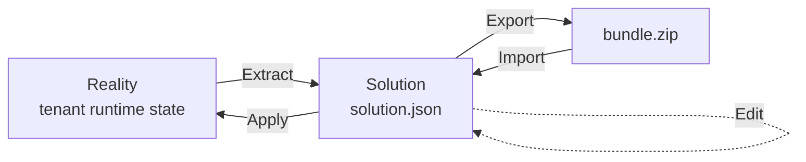

# ADR-0008 — Solution model & Workforce Studio

| Status | Proposed |
| --- | --- |
| Date | 2026-06-29 |
| Author | Yu Yu |
| Supersedes | — |
| Depends on | [ADR-0001 — Multi-tenancy from row 1](./multi-tenant.md), [ADR-0002 — Orchestrator + workers](./workers.md), [ADR-0003 — Plugin system](./plugins.md), [ADR-0004 — Plugin capabilities & sandbox contract](./plugins.md), [ADR-0007 — Skill progressive disclosure](./skill-progressive-disclosure.md) |

## Context

The Workforce Studio plugin (`plugins/workforce-studio/`) shipped in
0.4.1 as a read-only inspect-and-export tool: it builds a snapshot
of every plugin, the main agent prompt + tools + skills, and every
worker agent for the calling tenant, then offers a zip download.

That gets us "see what the system looks like right now". The next
two iterations made it clear that *seeing* the system isn't the
hard part — the hard part is **designing** the system. Operators
think in terms like:

- "What does my **research solution** look like? Which workers,
  which plugins, which skills, which prompt overrides?"
- "Take a snapshot of my current setup, save it, and let me
  re-apply it on another tenant or another machine."
- "Edit a solution offline, apply it back, see a diff before I
  commit."

A snapshot view ("look at reality") can answer the first question
indirectly, but not the second or third. Conflating the two — as
the 0.4.1 / 0.4.2 / `feat/workforce-studio-views` UI does — pushes
the studio toward an awkward middle ground where "Develop" is a
half-decorated reality view, not a real design tool.

This ADR introduces a **Solution** abstraction as a first-class
entity in the studio, distinct from the running system. From this
ADR forward the studio is a *configuration management* tool, not
just an inspector.

## Decision

### 1. Define **Solution**

A *Solution* is a **declarative description** of "what I want the
agent system to look like" for a tenant. It is a stable artifact
that:

- can be **extracted** from current reality,
- can be **edited** by hand (in the UI or directly as JSON),
- can be **applied** back to reality, mutating fs / config /
  plugin enable-state,
- can be **exported** as a zip and re-imported elsewhere,
- can be **diffed** against current reality or other solutions.

The crucial distinction is that a Solution is **never** what the
system currently is — it is **what the operator wants the system
to be**. Two solutions can exist for the same tenant; only one is
*active* at a time (applied).

### 2. Solution storage

Solutions live on the tenant filesystem, scoped to the tenant per
ADR-0001:

```
<home>/_tenant/solutions/
  <slug>/
    solution.json          # declarative description, sole source of truth
    main-agent/
      prompt.md            # optional tenant prompt override block
    workers/
      <worker-slug>/
        agent.json         # mirrors _tenant/config/workers/<slug>/agent.json shape
        SOUL.md            # optional worker system prompt
    README.md              # optional human notes / changelog
```

`solution.json` is the source of truth and the only file required
to declare a solution. Sidecar files (`prompt.md`, worker
`SOUL.md`) exist so multi-line content stays human-editable in fs
without being shoved into JSON string literals. `solution.json`
references them by relative path.

This layout deliberately mirrors the existing
`_tenant/config/workers/<slug>/` directory so that applying a
solution to reality reduces to a directory-level copy / merge,
and **extracting** reality into a solution reduces to the inverse
copy.

### 3. `solution.json` schema (v1)

```jsonc
{
  "schema": "tianshu.solution.v1",
  "slug": "research-team",
  "name": "Research Team",
  "description": "Multi-worker research solution with browser + memory wiki.",
  "createdAt": 1751180000000,
  "updatedAt": 1751280000000,

  // Source provenance — null when authored by hand, set when
  // extracted from a tenant snapshot so we can show "this is a
  // capture of <tenantId> taken on <date>" in the UI.
  "extractedFrom": {
    "tenantId": "default",
    "tianshuVersion": "0.4.2",
    "extractedAt": 1751180000000
  } /* or null */,

  "plugins": {
    // Explicit enable-list. The applier compares to current state
    // and enables/disables plugins to reach this set. Built-in
    // plugins missing from the list become *disabled*, not
    // removed — they're still on disk, just not active for this
    // tenant.
    "enabled": ["files", "workboard", "wechat", "web-search"]
  },

  "mainAgent": {
    // Path (relative to solution dir) to a markdown override
    // block that the host injects between the workspace context
    // block and plugin fragments. null = no override.
    "tenantPromptPath": "main-agent/prompt.md",

    // Skill allow / deny lists. null = no restriction (i.e. all
    // visible skills are included). When set, only skills whose
    // `name` appears in `allow` (and not in `deny`) reach the
    // main agent. Plugin-contributed skills are always implicitly
    // allowed regardless — the solution can only further-restrict
    // tenant-owned skills, not opt out of a plugin's own skill
    // contributions.
    "skillsAllow": null,
    "skillsDeny": [],

    // Tool allow-list for the main agent. Same semantics as
    // skills: null = no restriction. Use with care; the main
    // agent is normally tool-unrestricted.
    "toolsAllow": null
  },

  "workers": [
    {
      "slug": "researcher",
      "kind": "llm",
      "name": "Researcher",
      "description": "Deep-research worker with browser access.",
      "modelId": null,
      "enabled": true,

      // Worker prompt (multi-line) is in a sidecar SOUL.md.
      "systemPromptPath": "workers/researcher/SOUL.md",

      "toolsAllow": ["browser", "web_search", "web_fetch", "..."],
      "skillsAllow": ["deep-research", "..."],

      "source": "user"
    }
  ]
}
```

`schema` is a string version, **not** a numeric version, so v2
can introduce new keys without breaking v1 parsers.

### 4. Lifecycle operations



| Operation | What it touches |
| --- | --- |
| **Extract** | Reads current state via `host.workforceSnapshot.build(userId)` (already exists), writes `<home>/_tenant/solutions/<slug>/...`. Idempotent; safe to re-extract over an existing slug (asks for confirmation in the UI). |
| **Edit** | UI form or hand-edit `solution.json` on disk. No effect on reality until applied. |
| **Apply** | Reconciles reality to match the solution: writes plugin enable-state, copies worker dirs, writes prompt override. Non-destructive by default — only modifies the keys the solution mentions; per-key force flag drops keys not in the solution. Phase 2 supports the **non-destructive subset**; Phase 3 expands to plugin enable/disable. |
| **Export** | Bundles the solution dir into a zip with the same shape as the on-disk layout. |
| **Import** | Inverse of Export. Validates schema, refuses to overwrite an existing slug without confirmation. |
| **Diff** | Computes a structural diff between two solutions, or between a solution and current reality. Reported as add / change / remove per key. |

### 5. Two views in the studio

The studio is reorganised around the Solution / Reality split.
The current Develop / Rendered tabs collapse into this larger
distinction:

```
┌── Workforce Studio ──────────────────────────────────────┐
│  [ Solutions ▼ ]   research-team  ▾    [Apply] [Export]  │ ← solution-level
│ ───────────────────────────────────────────────────────  │
│  ( Solution view | Reality view )                        │ ← top-level toggle
│ ───────────────────────────────────────────────────────  │
│  ... view body ...                                       │
└──────────────────────────────────────────────────────────┘
```

- **Solution view** (designtime): renders `solution.json` for the
  currently-selected solution. Plugin list is the declared
  `enabled[]`; worker cards show the solution's worker spec;
  main-agent shows tenant prompt + skill allow-list. Editable
  fields have inline controls; plugin-contributed bits are still
  shown but marked auto-injected.
- **Reality view** (runtime): renders the existing
  `host.workforceSnapshot.build(...)` output. Plugin list is the
  active set (with failed/disabled rows); main-agent shows the
  rendered system prompt the next turn will see. This is what the
  current `feat/workforce-studio-views` branch already produces.

A small comparator above the toggle says "Solution differs from
Reality (3 changes)" with a link to a diff view, so the operator
can see drift without having to manually compare panels.

### 6. Default solution + "current" alias

Every tenant has a special solution slug `current` that the
studio maintains as a **live mirror of reality**:

- It is overwritten on every Extract (or automatically on
  application boot if the user opts in).
- It cannot be applied (applying `current` to reality is a no-op
  by definition).
- It cannot be deleted; deleting it just re-extracts on next
  access.

`current` exists so the studio always has a comparable baseline,
even before the operator authors their first named solution. The
"export current" button on the front page extracts → exports in
one click.

### 7. Phase plan

Workforce Studio's roadmap is restructured around this ADR. The
existing 0.4.1 / 0.4.2 features remain on `main` but are
recategorised under the *Reality view* of the new architecture.

| Phase | Status | Contents |
| --- | --- | --- |
| **Phase 1** | ✅ 0.4.1 | Reality view: snapshot + zip export |
| **Phase 1.5** | 🌿 branch | Reality view block decomposition (Develop / Rendered) |
| **Phase 2** | proposed | Introduce Solution abstraction: extract, save, list, edit (UI), diff. **No Apply yet.** |
| **Phase 3** | proposed | Apply solution to reality (non-destructive subset: prompt override + skills/tools allow-list + worker prompts). |
| **Phase 4** | proposed | Plugin enable/disable on Apply (destructive subset; needs careful UX with a confirm step). |
| **Phase 5** | proposed | Solution Library (templates, sharing, version history). |

Phase 2 specifically does **not** implement Apply: a solution is
a file on disk that has no runtime effect. That keeps the
ADR's first deliverable additive, safe to ship, and reversible
(deleting `<home>/_tenant/solutions/` removes every trace).

### 8. Disposition of `feat/workforce-studio-views`

The Develop / Rendered split currently on
`feat/workforce-studio-views` becomes the **Reality view**'s
internal block decomposition: it is still useful (operators want
to see what blocks the model receives), but it is not the
top-level toggle.

We **merge** `feat/workforce-studio-views` as-is and rename its
internal "Develop / Rendered" toggle to "Block view / Rendered
view" so it doesn't conflict with the Solution / Reality
terminology this ADR introduces. Phase 2 work then builds the
Solution view alongside the existing Reality view, with a new
top-level toggle.

## Consequences

### Positive

- Operators can think in **solutions**, not in raw filesystem
  paths. Multi-tenant operators get a portable artifact for
  bootstrapping new tenants.
- Apply / Extract are inverses (within their supported subset),
  which makes the studio testable: extract → apply → diff should
  yield empty.
- The Solution / Reality split makes "what's editable" explicit:
  Solution view = "you authored this, edit freely"; Reality view
  = "this is observation, you change it by changing a solution
  and applying".

### Negative

- Larger feature surface than the original "inspect + export"
  scope. We mitigate by phasing strictly (no Apply in Phase 2)
  and by keeping `current` as the default — operators who never
  author a named solution see no behavioural change.
- Apply on plugin enable/disable (Phase 4) is non-trivial because
  plugins have activate/deactivate side effects. Phase 4 will
  rely on the existing `pluginRegistry.invalidate(tenantId)`
  path the plugin manager already uses, so the destructive part
  inherits whatever guarantees plugin manager already has.

### Open questions (to revisit when implementing)

- Should solutions be **versioned** inside the slug
  (`<slug>/v1/...`)? Likely yes for Phase 5, no for Phase 2.
- Should `solution.json` carry a signature / hash so we can
  detect manual tampering? Defer until Phase 5 import / share
  flows are real.
- Multi-user: solutions are per-tenant, not per-user. A solution
  authored by user A can be applied by user B in the same
  tenant. Worth re-checking with permissions when ADR-0001's
  user model evolves.

## References

- ADR-0001 (multi-tenancy, fs layout)
- ADR-0002 (workers + agent.json + SOUL.md conventions)
- ADR-0003 (plugin contributions surface)
- ADR-0007 (skill progressive disclosure — affects what
  "skillsAllow" can do)
- Workforce Studio Phase 1 PR #262, Phase 1.5 branch
  `feat/workforce-studio-views`
